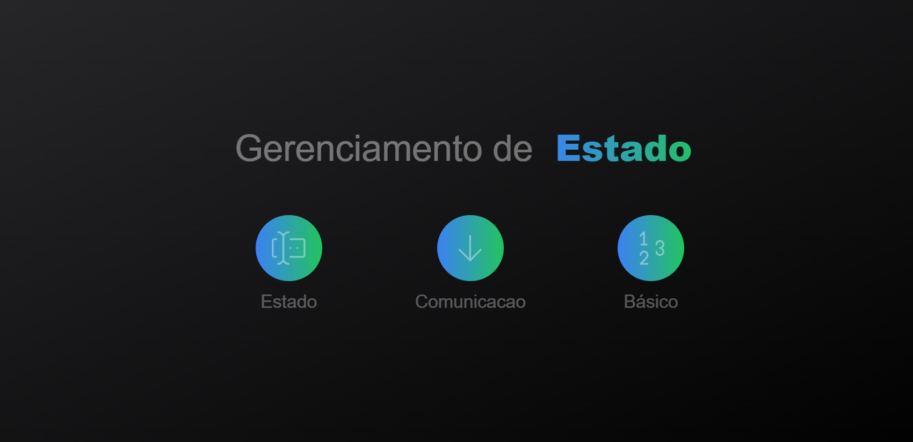
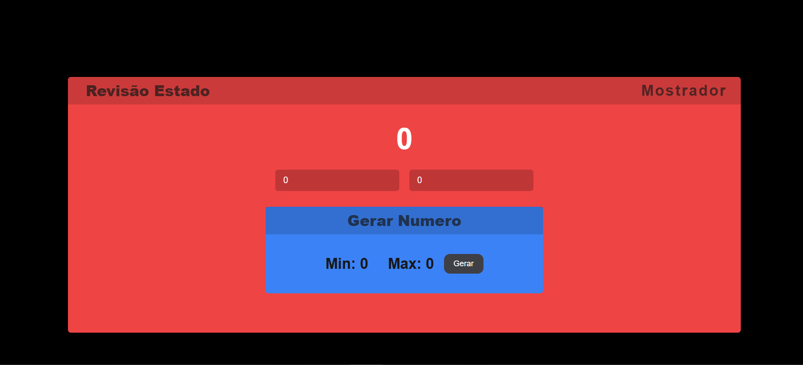
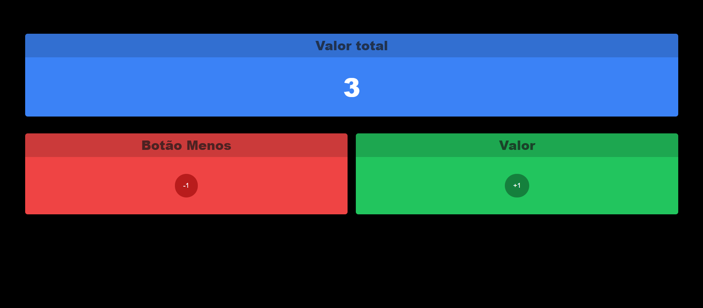

npm install @tabler/icons-react

### Screens
* Menu


* 2 - Estados


* 3 - Contexto


* 4 - Lojinha
<br />
#### Ref.
```
https://escola.formacao.dev/especialista-dev/sala/react-gerencia-estado?aula=7be1de2d-5417-4788-8b15-03debf873b24
```